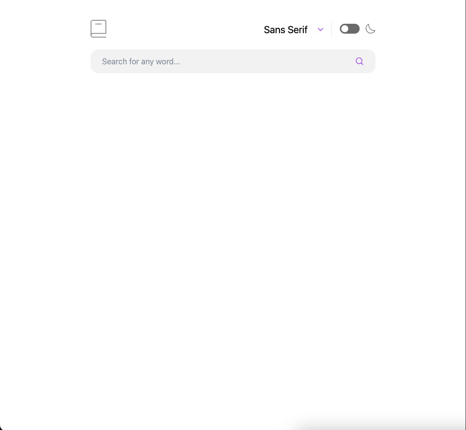
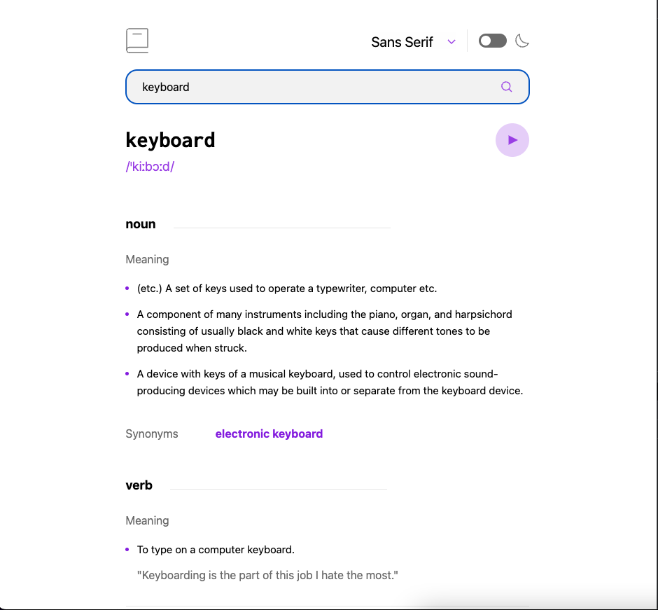
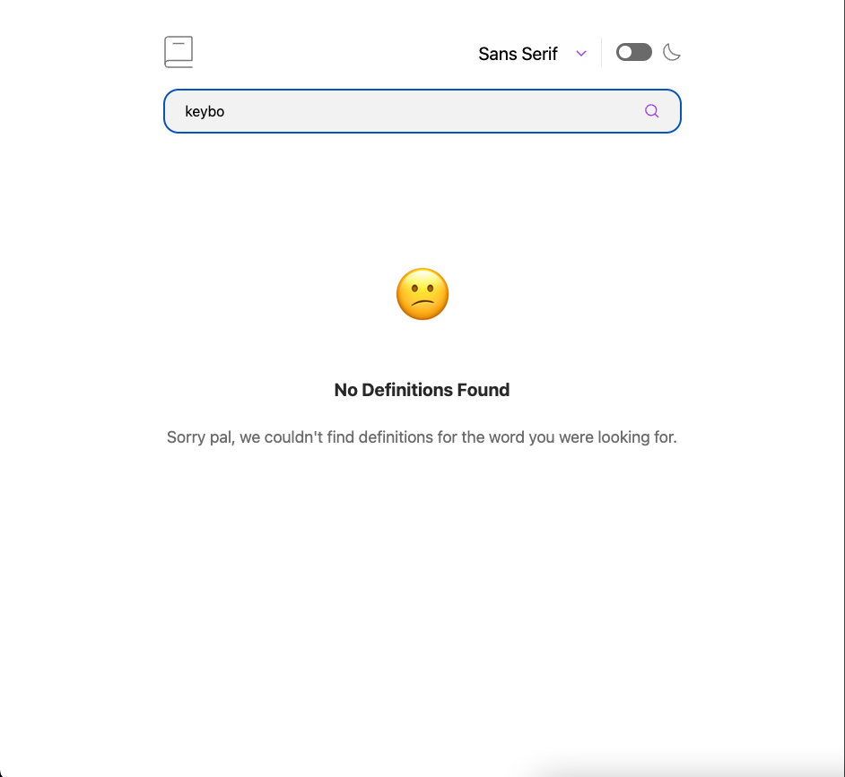
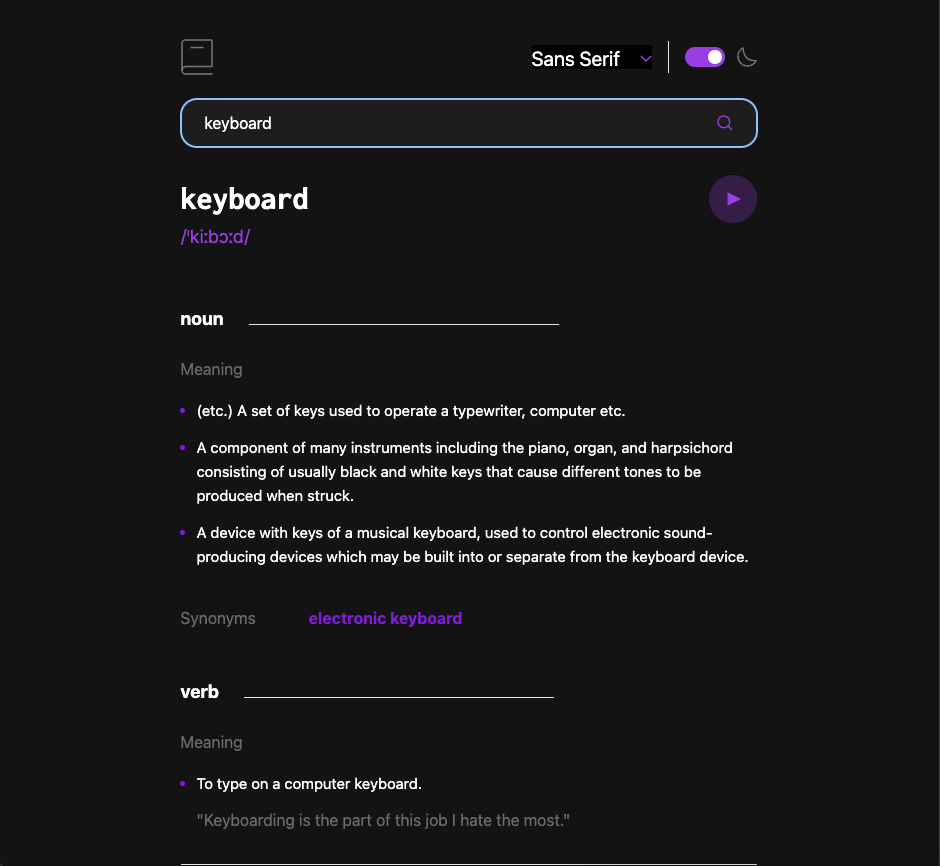

# Frontend Mentor - Dictionary web app solution

This is a solution to the [Dictionary web app challenge on Frontend Mentor](https://www.frontendmentor.io/challenges/dictionary-web-app-h5wwnyuKFL). Frontend Mentor challenges help you improve your coding skills by building realistic projects. 

## Table of contents

- [Overview](#overview)
  - [The challenge](#the-challenge)
  - [Screenshot](#screenshot)
  - [Links](#links)
- [My process](#my-process)
  - [Built with](#built-with)
  - [What I learned](#what-i-learned)
- [Author](#author)

**Note: Delete this note and update the table of contents based on what sections you keep.**

## Overview

In this project, you'll integrate with the Dictionary API to create a real-world dictionary web app. Additional tests include colour themes and font selection.

### The challenge

Users should be able to:

- Search for words using the input field
- See the Free Dictionary API's response for the searched word
- See a form validation message when trying to submit a blank form
- Play the audio file for a word when it's available
- Switch between serif, sans serif, and monospace fonts
- Switch between light and dark themes
- View the optimal layout for the interface depending on their device's screen size
- See hover and focus states for all interactive elements on the page

### Screenshot







### Links

- Solution URL: [Add solution URL here](https://your-solution-url.com)
- Live Site URL: (https://dictionary-web-app-mu.vercel.app)

## My process

I took the overall project and broke it down into small pieces, such as components. For example, I knew early on the HeaderBar component would house the font dropdown menu and the darkmode switch. It was easier to get the basic design on the page, where then I worked my way down the page. I created components for the search field and the search results.

After I styled the search field component, I added functionality, and hooked up the API call that ultimately would return the search results. Once I had that working, and could bring in the data and style the search result component. 

Once I completed the search result component, I made my way back up the page to add little details and addtional functionality. 

### Built with

- React
- Tailwind CSS
- TypeScript
- Mobile-first workflow
- Next.js

### What I learned

Use this section to recap over some of your major learnings while working through this project. Writing these out and providing code samples of areas you want to highlight is a great way to reinforce your own knowledge.

To see how you can add code snippets, see below:

```html
<h1>Some HTML code I'm proud of</h1>
```
```css
.proud-of-this-css {
  color: papayawhip;
}
```
```js
const proudOfThisFunc = () => {
  console.log('🎉')
}
```

If you want more help with writing markdown, we'd recommend checking out [The Markdown Guide](https://www.markdownguide.org/) to learn more.

**Note: Delete this note and the content within this section and replace with your own learnings.**

### Continued development

Use this section to outline areas that you want to continue focusing on in future projects. These could be concepts you're still not completely comfortable with or techniques you found useful that you want to refine and perfect.

## Author

- Frontend Mentor - [@theidriselijah](https://www.frontendmentor.io/profile/theidriselijah)
- Twitter - [@theidriselijah](https://www.twitter.com/theidriselijah)
